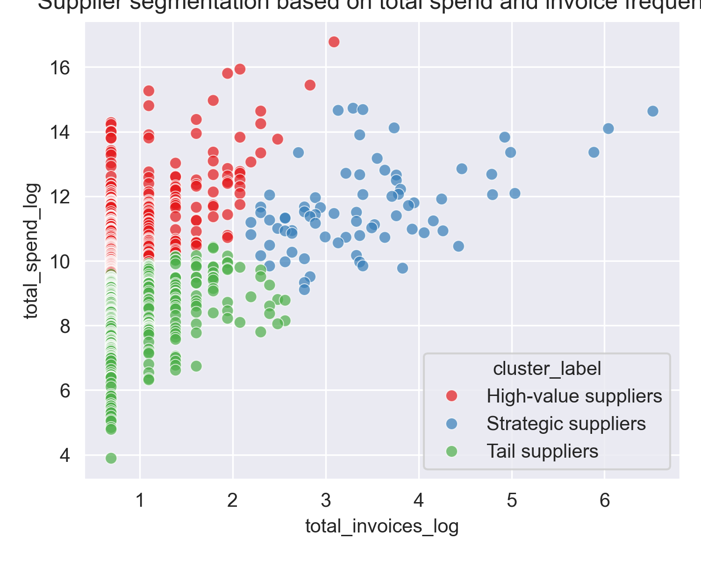

# Supplier Segmentation using K-Means


This project uses unsupervised learning to analyze invoice data and identify meaningful supplier segments. The focus is on translating analytical results into insights that are understandable and usable in a business context.

It helps answer questions such as:

- Which suppliers show characteristics of strategic partners and may require closer attention in contract management?
- Which suppliers represent relatively low spend (tail spend) and may indicate opportunities for consolidation?
- How can supplier segmentation support prioritisation in procurement activities?
---
### 📊 Example output

Below is an example of the supplier segmentation based on total spend and invoice frequency.




### 📁 REPOSITORY STRUCTURE
```
SupplierSegmentation-Clustering/
│
├── data/
│   ├── raw/
│   └── processed/
│
├── notebooks/
│   ├── 01_data_loading_and_preprocessing.ipynb
│   ├── 02_exploratory_data_analysis.ipynb
│   └── 03_supplier_segmentation.ipynb
│
├── src/
│   ├── 01_data_loading_and_preprocessing.py
│   ├── 02_exploratory_data_analysis.py
│   ├── 03_supplier_segmentation.py
│   └── run_pipeline.py
│
├── outputs/
│
├── .gitignore
├── LICENSE
└── README.md
```
---
### 🔢 DATA

The analysis uses an open dataset published via the European Open Data Portal.

Source: https://data.europa.eu/data/datasets/https-catalog-ale-se-store-1-resource-91

License: Creative Commons Attribution 4.0 International (CC BY 4.0)  
https://creativecommons.org/licenses/by/4.0/

The original dataset is not included in this repository. To run the project yourself, download the dataset from the source above and place the CSV file in:

```
data/raw/
```
---
### 🧠 METHODOLOGY

The project follows a standard analytical workflow to transform the raw data:

1. **Data loading & preprocessing**  
   [01_data_loading_and_preprocessing.ipynb](./notebooks/01_data_loading_and_preprocessing.ipynb)
   Includes: data loading, preparation and initial cleaning.

2. **Exploratory data analysis**  
   [02_exploratory_data_analysis.ipynb](./notebooks/02_exploratory_data_analysis.ipynb)
   Includes: exploratory analysis and feature engineering.
   
3. **Supplier segmentation using K-Means**  
   [03_supplier_segmentation.ipynb](./notebooks/03_supplier_segmentation.ipynb)
   Includes: model preparation, clustering and cluster interpretation
---
### 🚀 RUNNING THE PIPELINE

To run the full analysis pipeline locally:

1. Clone the repository
   
```bash
git clone https://github.com/VreekenDatahoeve/SupplierSegmentation-Clustering.git
cd SupplierSegmentation-Clustering
```

2. Run the pipeline
```bash
python src/run_pipeline.py
```

This will sequentially execute the full workflow including data loading, preprocessing, exploratory analysis and supplier clustering.

---
### 📦 OUTPUTS

Running the pipeline will generate the following outputs:

- Supplier segmentation dataset (CSV) with assigned cluster labels
- Cluster summary tables
- Visualisations used to evaluate and interpret the clustering results
- Evaluation metrics supporting the cluster selection process

The generated files are stored in the `outputs/` directory.

---
### ⚖️ LICENSE

This project is licensed under the MIT License – see the LICENSE file for details.

---
### 🗺️ ROADMAP

I am currently working on an extension of this project, which includes:

* Enrich segmentation with contract features.
* Extend toward supplier risk prediction.
* Developing ready-to-use dashboard for decision support.
  
---
### ⭐ If you found this useful
Feel free to star the repository or share your thoughts.
